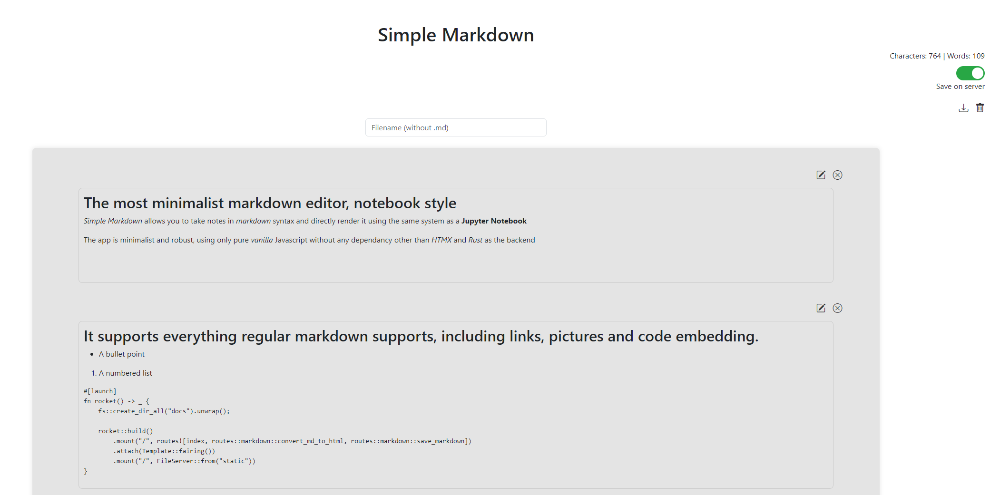

## Simple Markdown

### The most minimalist markdown editor, notebook style

_Simple Markdown_ allows you to take notes in _markdown_ syntax and directly render it using the same system as a **Jupyter Notebook**

The app is minimalist and robust, using only pure _vanilla_ Javascript without any dependancy other than _HTMX_ and _Rust_ as the backend

Simply type your markdown text in a cell and hit Ctrl + Enter to render it and create a new cell.

It supports everything regular markdown supports, including links, pictures and code embedding.

When you are done, your file can be saved either in browser or on the server where _Simple Markdown_ is hosted.




### Installation

#### Docker

The easiest way to install _Simple Markdown_ is to use _Docker_.
Clone the repository, `cd` into it and run the following commands:

```bash
docker build -t simple-md  .
docker run -d -p 8080:8080 -v /path/to/docs:/app/docs simple-md
```

You can then access the app at `http://localhost:8080`